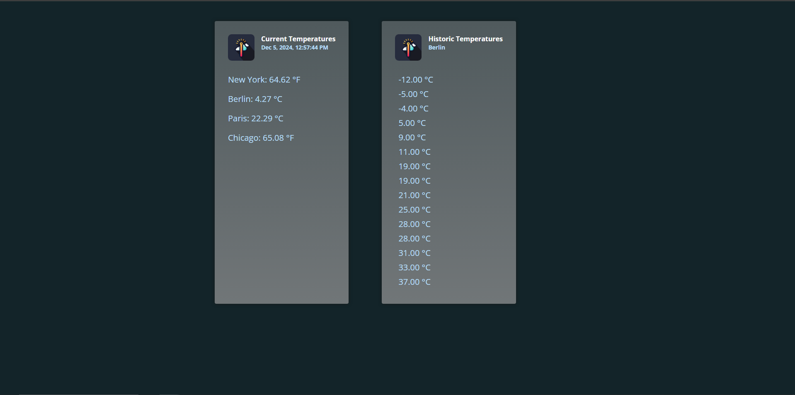

# Documentation for **TemperaturePipe**

#### Overview

**TemperaturePipe** is a lightweight Angular application that demonstrates the use of custom pipes for data transformation. It focuses on showcasing reusable and modular components for sorting and temperature conversion.

---

## Demo



## Project Structure

The project adheres to Angular’s standard structure, emphasizing simplicity and reusability.

- **src/app/**: Main application directory containing the root component and custom pipes.
  - **app.component.\***: Root component managing the application layout and logic.
  - **sort.pipe.ts**: A custom pipe for sorting data arrays.
  - **temperature.pipe.ts**: A custom pipe for converting temperature values between Celsius, Fahrenheit, and other units.
- **src/styles.css**: Global styles for the application.

---

## Key Features

**Custom Pipes**:

- **Sort Pipe**:
  - Sorts arrays based on specified criteria.
  - Fully customizable for ascending or descending order.
- **Temperature Pipe**:
  - Converts temperature values between different units (e.g., Celsius to Fahrenheit).
  - Ensures accurate and user-friendly data representation.

---

## How to Run the Project

1. **Clone the Repository**:

   ```bash
   git clone https://github.com/FilonenkoDima/TemperaturePipe.git
   cd TemperaturePipe
   ```

2. **Install Dependencies**:
   Ensure you have Node.js and Angular CLI installed, then run:

   ```bash
   npm install
   ```

3. **Run the Application**:

   ```bash
   ng serve
   ```

   The app will be accessible at `http://localhost:4200/`.

4. **Build for Production**:
   ```bash
   ng build --prod
   ```

---

## Technologies Used

- **Frontend**: Angular
- **Styling**: CSS
- **Build Tools**: Angular CLI
- **Version Control**: GitHub

---

## Contribution Guidelines

1. Fork the repository.
2. Create a new feature branch:
   ```bash
   git checkout -b feature/your-feature-name
   ```
3. Commit your changes and push the branch:
   ```bash
   git push origin feature/your-feature-name
   ```
4. Submit a pull request for review.
